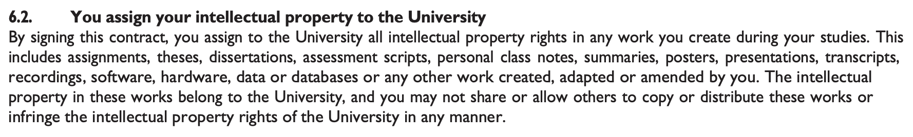

# Open source software created at South African educational instutitions

This repo is the beginning of a list of software projects created by students from South African academic institutions.

## Background

Roger Saner began a Masters in Philosophy in Embodied Complexity at Stellenbosch University in 2023, and noticed that part of the student contract that the university required him to sign included this section on intellectual property:

It reads:

> 6.2 You assign your intellectual property to the University
> By signing this contract, you assign to the University all intellectual property rights in any work you create during your studies. This includes assignments, theses, disserations, assessment scripts, personal class notes, summaries, posters, presentations, transripts, recordings, software, hardware, data or databases or any work created, adapted or amended by you. The intellectual property in these works belong to the University, and you may not share or allow others to copy or distribute these works or infringe the intellectual property rights of the University in any manner.

With regards to open source software, this raises the question, "Who has managed to release open source software which was created while studying at a South African university?"

## List of open source software created by students while at South African universities

* [cilib](software/cilib.md), created by [Gary Pamparà](https://github.com/gpampara): `Typesafe, purely functional Computational Intelligence`. Initially GPL 3.0, now Apache License.

### Adding software

The easiest is to [open an issue](https://github.com/BurningDog/sa-academic-software/issues/new?assignees=&labels=&template=open-source-software.md&title=%5BSoftware%5D+)!

## List of tertiary eductation institutions' contracts regarding intellectual property

* [Stellenbosch University](contracts/stellenbosch-university.md)

### Adding a contract

To add a contract, [open an issue](https://github.com/BurningDog/sa-academic-software/issues/new?assignees=&labels=&template=university-contract-regarding-intellectual-property.md&title=%5BContract%5D+)