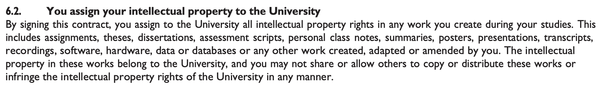

# Stellenbosch University

Year: 2023.

Context: student contract.

It reads:

> 6.2 You assign your intellectual property to the University
> By signing this contract, you assign to the University all intellectual property rights in any work you create during your studies. This includes assignments, theses, disserations, assessment scripts, personal class notes, summaries, posters, presentations, transripts, recordings, software, hardware, data or databases or any work created, adapted or amended by you. The intellectual property in these works belong to the University, and you may not share or allow others to copy or distribute these works or infringe the intellectual property rights of the University in any manner.
